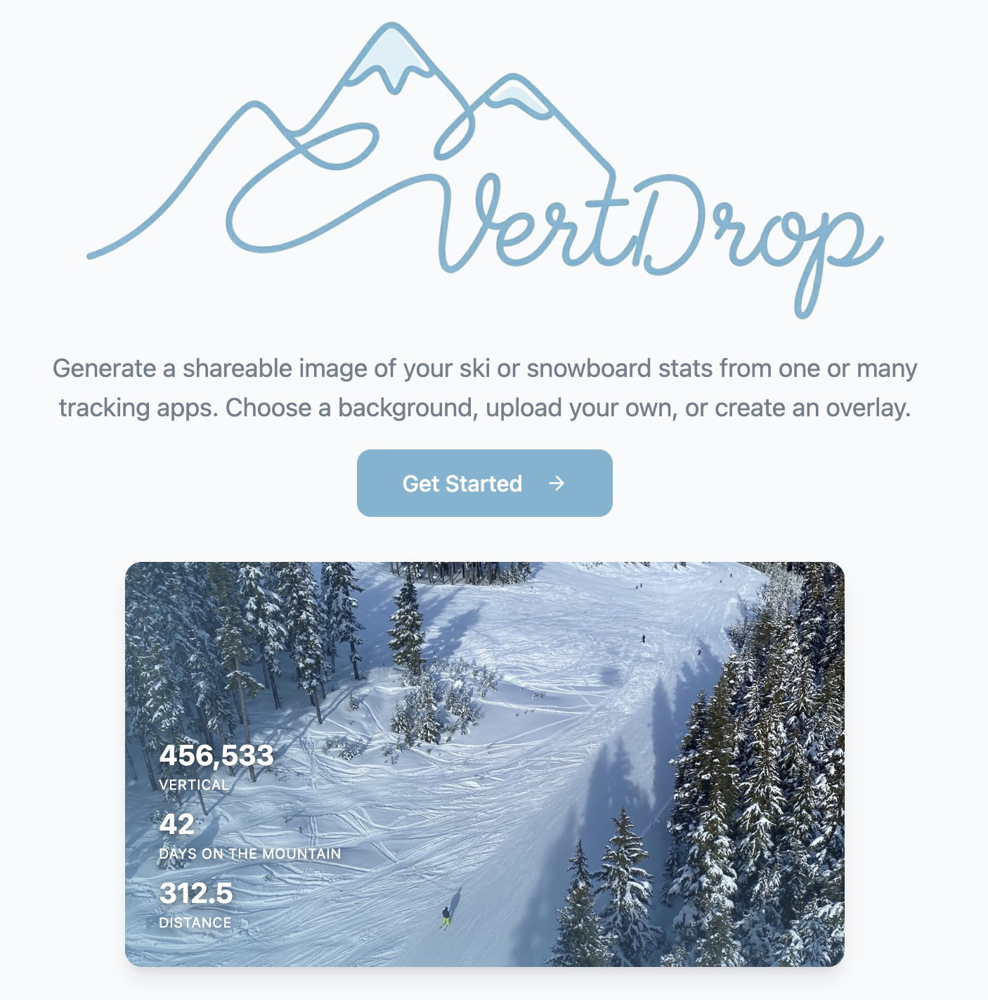
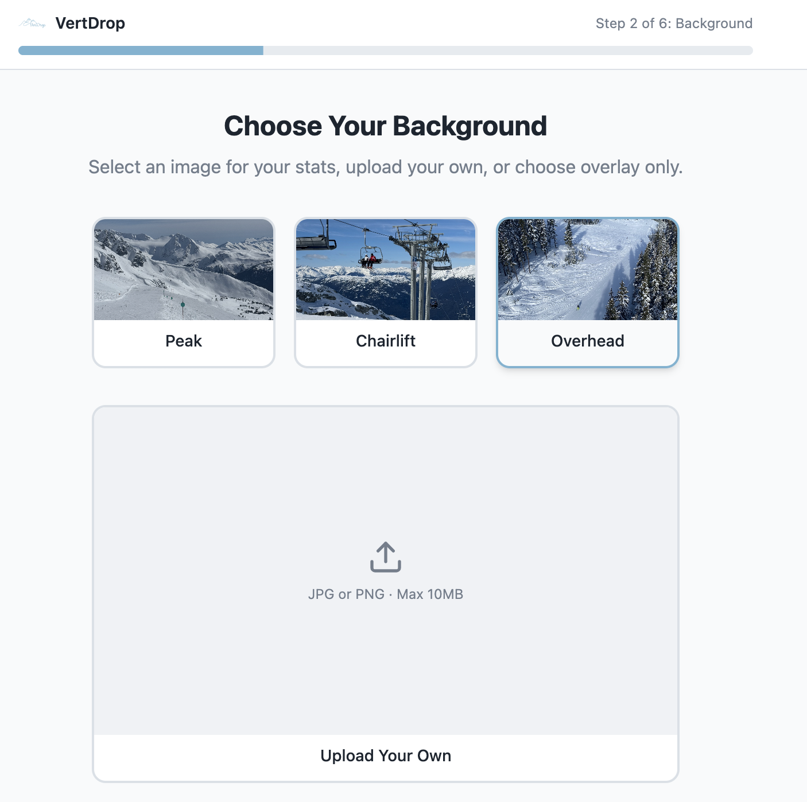
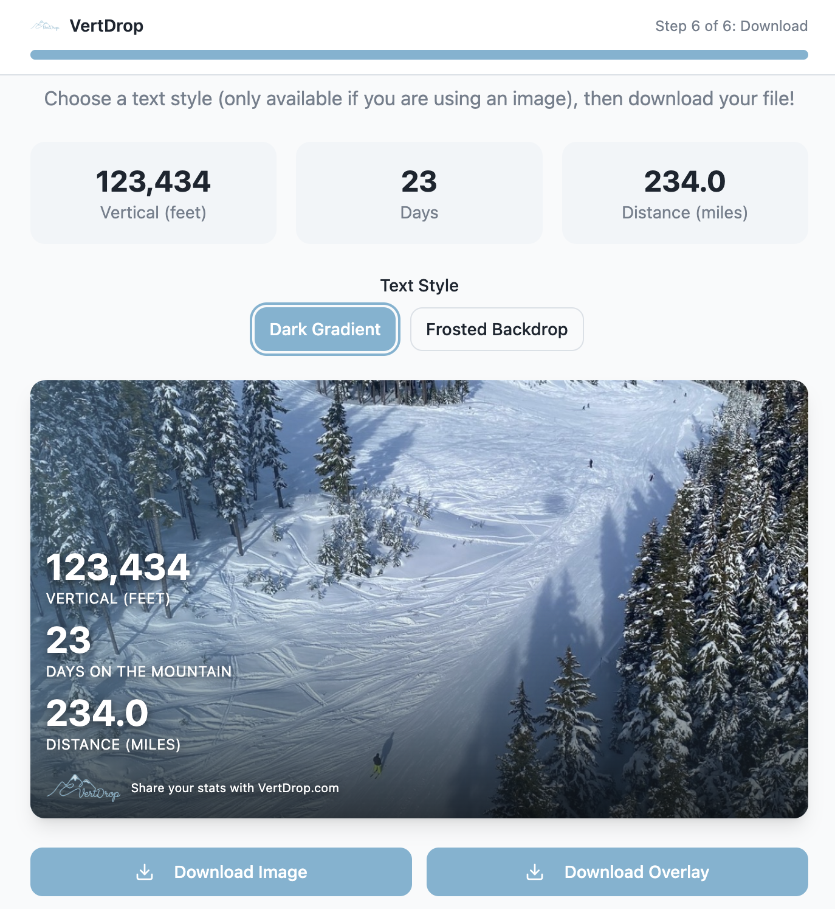

# VertDrop

A zero-login stat card generator for skiers and snowboarders.

Live: https://vertdrop.com

---

## The Problem

Skiers track days across a fragmented set of apps (Slopes, Epic, Ikon, Strava, Apple Health). At season's end, they want to share a clean stat card on Instagram or Threads. VertDrop is a tool to easily aggregate across apps to output a correctly-sized, share-ready image.

## What I Built

A 6-step browser-only flow that turns numbers from any combination of tracking apps into a polished, downloadable image in under a minute.

1. Overview — sample output and tool explanation

2. Image selection — preset photo, custom upload, or transparent overlay

3. Optimization — destination platform selection (IG Story, IG Post, Threads/X) for correctly-sized output

4. Customize — imperial/metric, metric toggles (vertical, days, distance)

5. Stats — manual entry across up to 10 apps; totals summed automatically

6. Download — preview and export

Everything runs client-side. No account, no server, no data leaves the browser.

## Product Decisions Worth Noting

- **No login** - Sign-up friction would kill conversion for a single-use tool. The image is the value, not the account. Trade-off: no saved history or cross-device sync, accepted by design.

- **Platform-aware exports** - Rather than export one size and ask users to crop, step 3 asks where they're posting. The downloaded file is optimized for those platforms (e.g. 1080x1920 for Stories or 1200x675 for Threads/X).

- **Versatile** - Originally focused on end-of-season summaries, the images generated now use language that would allow you to generate images for a single day, single trip, or whole season to cover more use cases.

## Version History

**v1.0 — MVP**

- 6-step wizard, 3 preset backgrounds, multi-app entry, imperial/metric toggle, single image size export.

**v1.1 — Platform specificss**

- Per-platform sizing added to the Optimization step; users no longer need to adjust after download.

**v1.2 — Polish & reach**

- Mobile-responsive testing, SEO and branding pass.

## Screenshots

Homepage

Image selection

Final image ready for download

